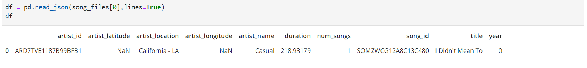
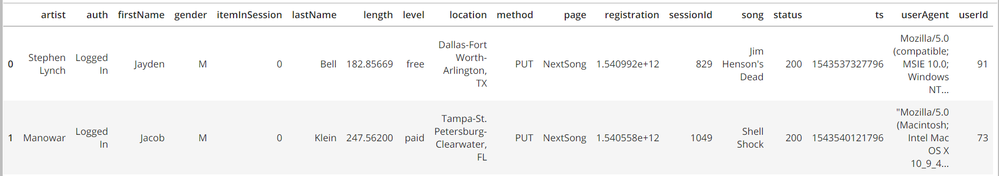

# Introduction
<p>Sparkify is a music streaming startup whose user and music metadata resides in AWS cloud as json files in AWS S3 buckets. <br>Untill now, song and user-activity data collected in JSON files by the Sparkify team was stored in a Data Warehouse. But, with the increasing data they want to move their data to Data lake from a DWH.<br>This project is an implementation of an ETL pipeline to extract data from S3, processes them using Spark, and load the data back into S3 as a set of dimensional tables.<br>The Analytics team at Sparkify will further  use the processed data to derive useful insights for their business.</p>


# Dataset:
Below are the two input files used in this project, both the files reside on AWS S3:
### 1. <i>Song Dataset</i>
<b> File Path </b> : s3://udacity-dend/song_data
<p>The first dataset consists of song files in JSON format. These files contain metadata about a song and the artist of that song. The files are partitioned by the first three letters of each song's track ID. Below is the snippet of example of how song dataset looks like:</p>



### 2. <i>Log Dataset</i>
<b> File Path </b> :s3://udacity-dend/log_json_path.json
<p>The second dataset consists of log files in JSON format generated by this event simulator based on the songs in the dataset above. The log files in the dataset are partitioned by year and month. Below is the snippet of example of how log dataset looks like:</p>




# Data Model:
Below is the conceptual design for the Sparkify datalake model:

1. The different components of ***star schema*** incudes:
     **Fact Table**: songplays<br>
     **Dimension Table**: songs, artists, users, time

2. To optimize data processing, partitioning technique has been used on following:
   - **songplays**: based on year, month
   - **songs**: based on year, artist_id
   - **time**: based on year, month


# ETL Pipeline:
- ETL processing has been implemented using pyspark.
- Firstly, data is retrieved from s3, it is then processed using pyspark on a EMR cluster or by directly running etl.py
- Dataframes are extracted from the input files for the analytics tables(users, songs, artists, time, songplays)., which is then stored into paraquet files. 
- Then after processing, these files are loaded back into s3.
- This processed data can be used by Sparkify analytics team to perform further analysis.


# Project Files and Folders:
1. <b>dl.cfg:</b> Contains users AWS credentials required to retrieve and store data on AWS S3 .(Required when you are running the script locally and not on AWS)
2. <b>etl.py/sparkify.ipynb:</b> contains pyspark code to read input data from S3, process them using Spark, and load output data back into S3 as a set of dimensional tables.
3. <b>README.md:</b> provides breif description about the project and how to run the files.
4. <b>images: </b> folder contains SS for images used in Readme file

# Steps to run the project:
Follow the below steps to run the project:

**METHOD 1:**
1. **dl.cfg**: Populate this file with AWS credentials(without quotes) if you want to run the code locally.
2. **etl.py**: run this file to read and load data from S3, process it and load data to final analytics tables in S3.

**METHOD 2:**
1. **sparkify.ipynb**: run this notebook's code by spinning an EMR cluster on AWS and using Jupyter notebook option.

# Sample Queries:
Below sample queries can be found at the end of the file-<b>sparkify.ipynb</b>:


#### 1.  Find the total number of paid and free users:
```python
users_df = spark.read.parquet("s3a://juhi-sparkify/users")
users_df.createOrReplaceTempView("users")
spark.sql("""
    select
        level as subscription_level,
        count(userid) as total_count
    from 
        users
    grroup by 1""").show()
```


#### 2.Total number of songs played year wise in descending order(SS only contains results only for year2018 as test was done on small dataset):
```python
songplays_df = spark.read.parquet("s3a://juhi-sparkify/songplays")
songplays_df.createOrReplaceTempView("songplays")
spark.sql("""
    select
        year,
        count(*) as songplay_count
    from 
        songplays
    group by 1
    order by 2 desc;
""").show()
```
